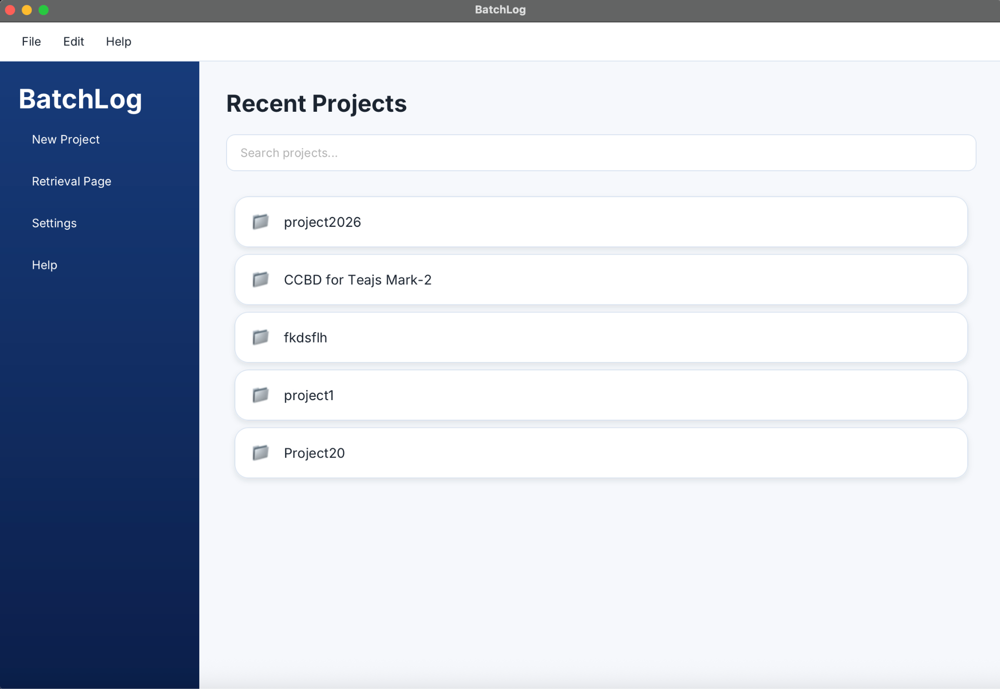
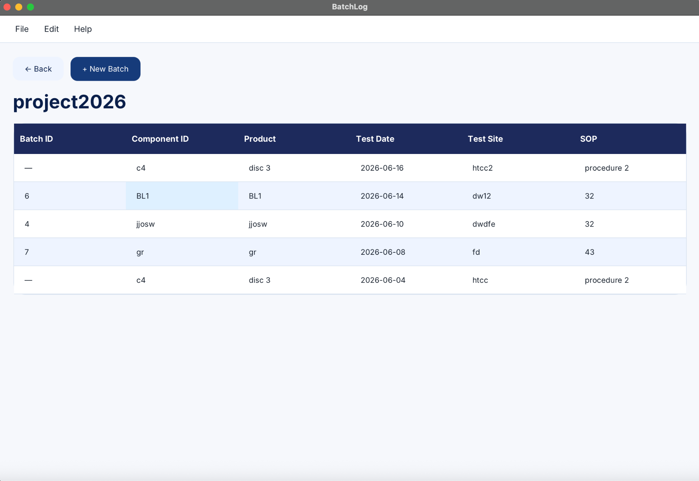
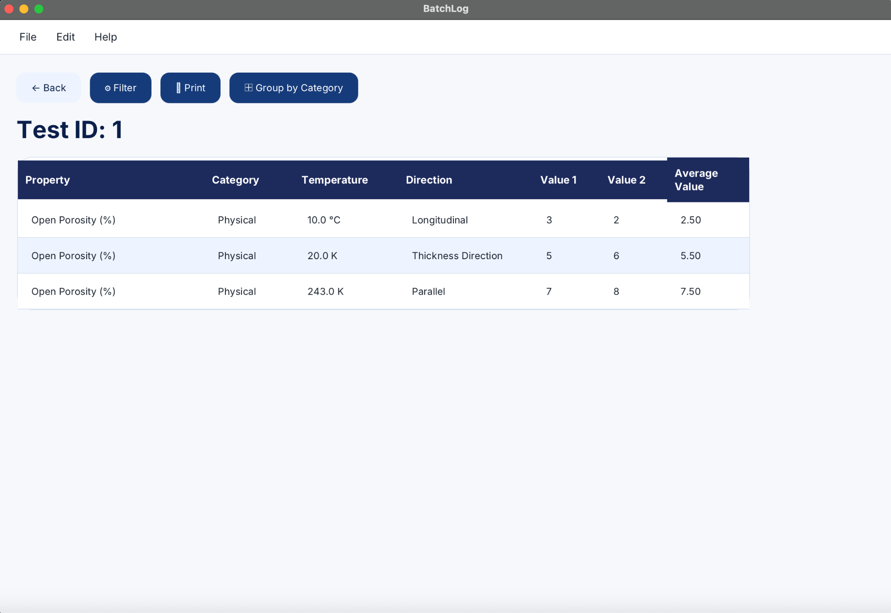
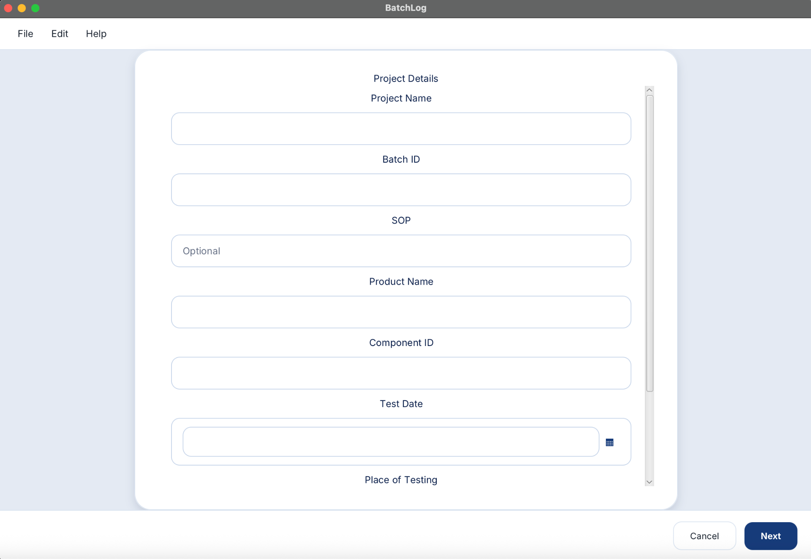
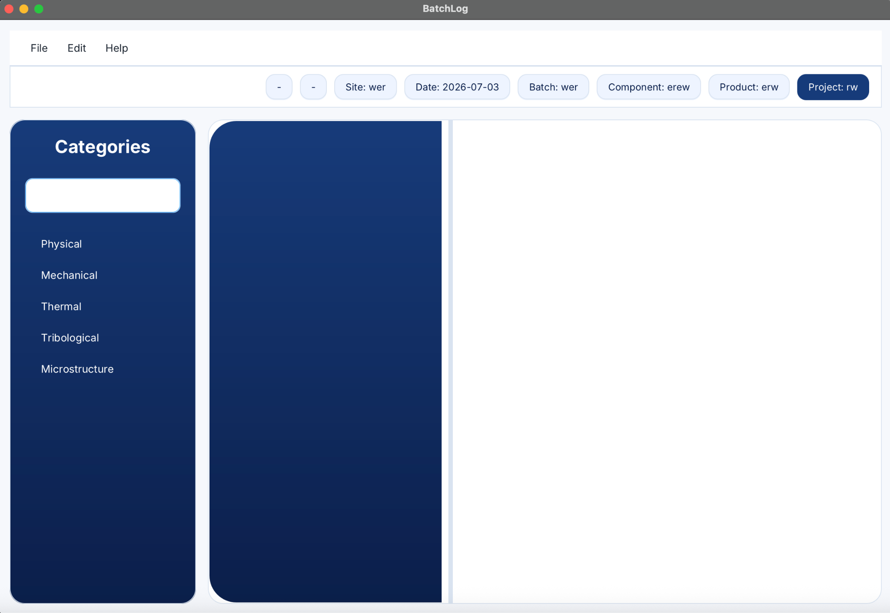
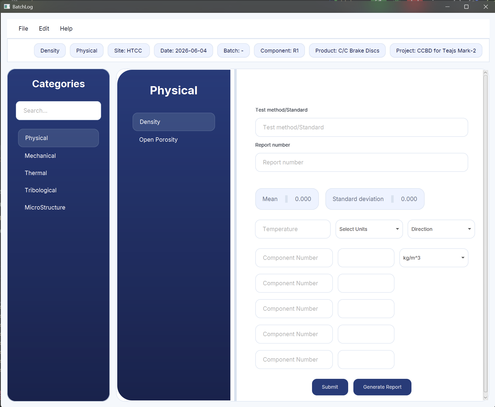
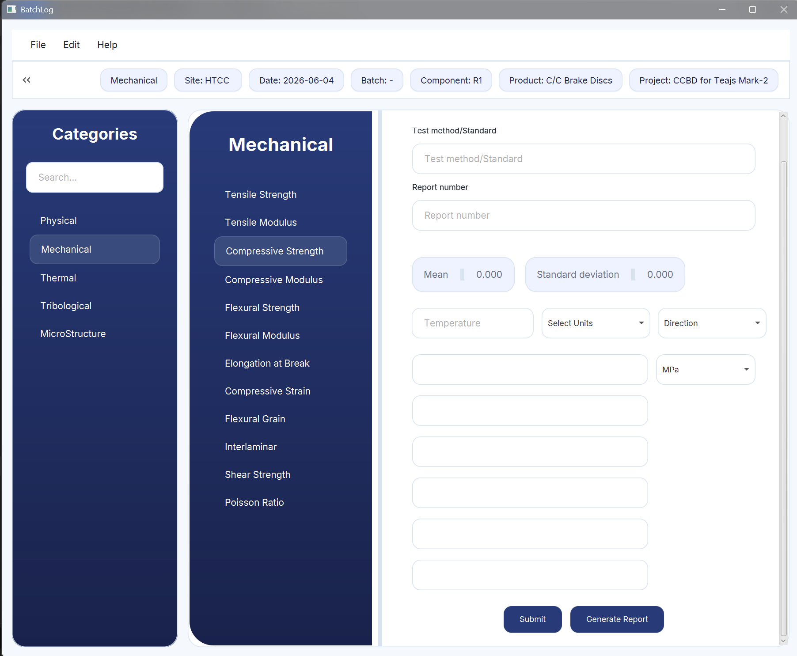
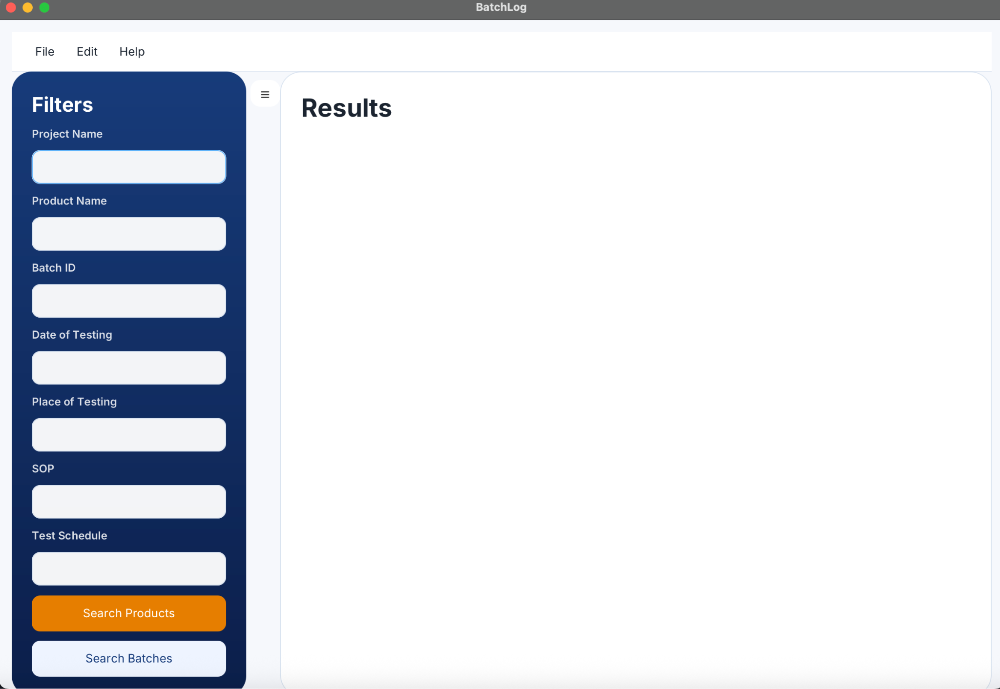
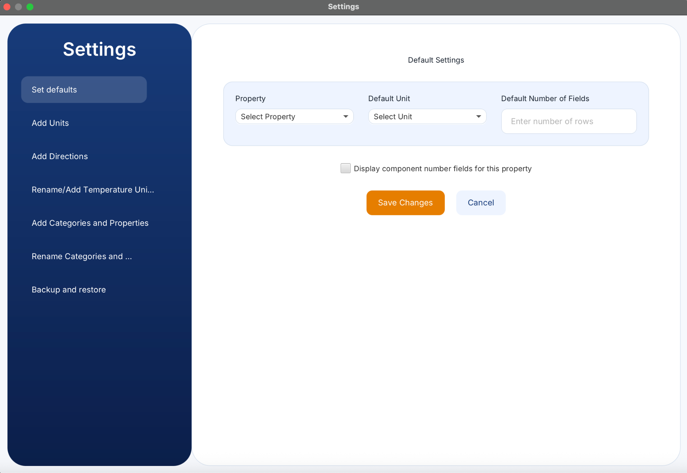

# BatchLog

**Test Data Management System**

BatchLog is a desktop application built with Java and JavaFX for managing engineering and laboratory test data. It gives users a structured way to organize projects, batches, products (components), and test properties, with powerful retrieval, comparison, and reporting built in.

The application centralizes storage and analysis of test results — record measurements, keep historical data, compare batches or products, and generate detailed reports — all from a single desktop interface built for lab and quality-control workflows.

## Objectives

1. Provide a centralized platform for recording test data
2. Manage projects, batches, products, and associated tests
3. Support both batch-based tests and standalone product tests
4. Enable efficient retrieval and comparison of historical data
5. Generate printable PDF reports
6. Provide an intuitive desktop interface for laboratory and quality-control workflows

## Technologies Used

| Layer | Stack |
|---|---|
| Frontend | JavaFX, FXML, CSS |
| Backend | Java, JDBC |
| Database | SQLite |
| Tools | IntelliJ IDEA, Maven, Git |

## System Architecture

The application follows a layered architecture:

- **UI Layer** — JavaFX controllers, FXML views
- **Service Layer** — Business logic, validation, state management
- **DAO Layer** — Database access using JDBC
- **Database Layer** — SQLite relational database

## Features

- **Project Management** — Create, rename, and delete projects; view recent projects
- **Batch Management** — Create batches, edit batch information, associate batches with products
- **Product Test Support** — Support tests without batches; component-based testing
- **Category and Property Management** — Dynamic categories, property entry forms, value validation
- **Retrieval System** — Search by project name, product name, batch ID, test date, test site, or SOP
- **Batch Comparison** — Compare multiple batches based on average property values
- **Product Comparison** — Compare standalone product tests
- **Filtering** — Property filtering, batch/product selection
- **PDF Export** — Generate detailed reports with project, batch, and component information, test site, test date, and property measurements
- **Search and Navigation** — Fuzzy project search, recent projects page, context menus

## Screenshots

### Home Page

### Project Page

### Test Results Page

### New Project Page

### Categories Page

### Categories Page with Component Number Fields

### Categories Page without Component Number Fields

### Retrieval Page

### Settings Page

## Team

- N. Abhignan Reddy
- Aryan Jingade
- M. Praneet Reddy

Submitted this project to ASL.
